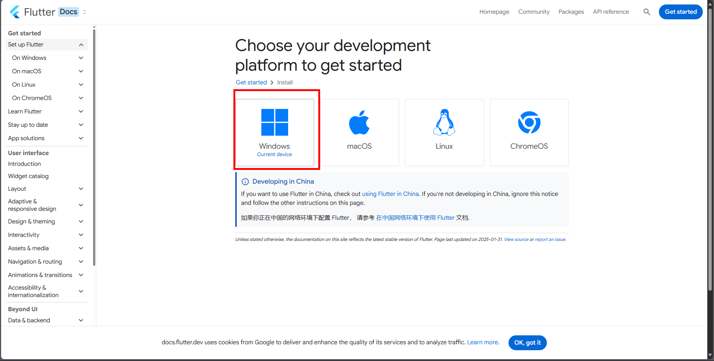
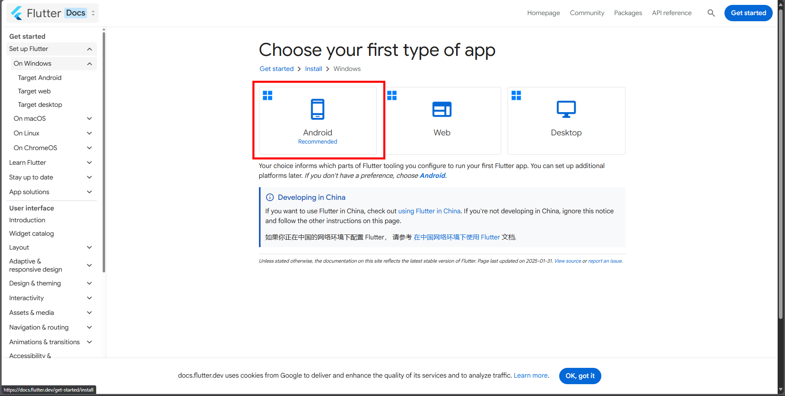
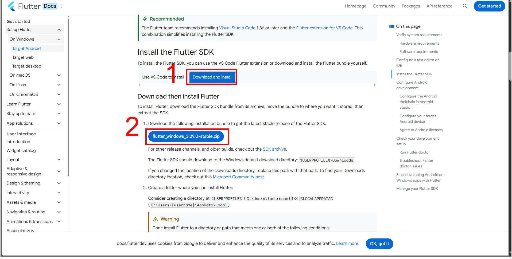
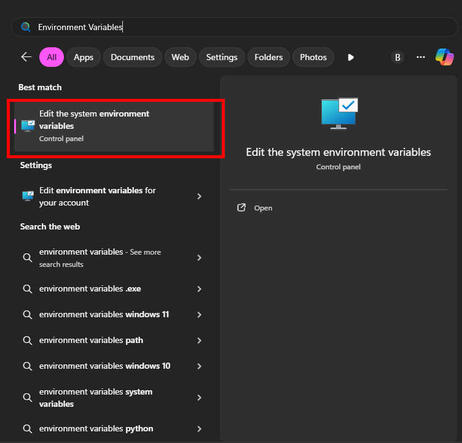
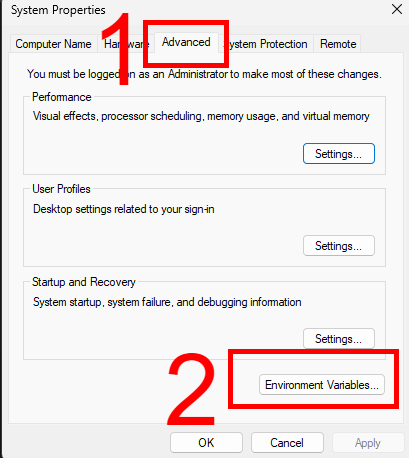
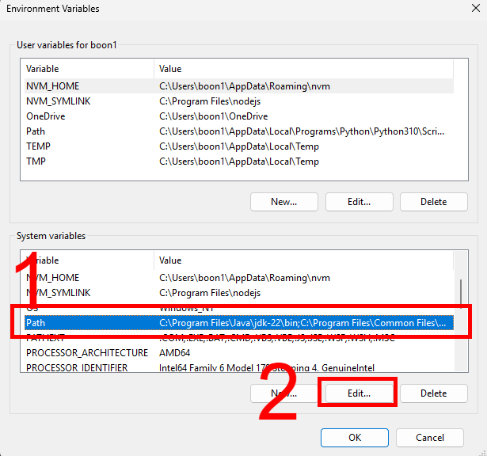
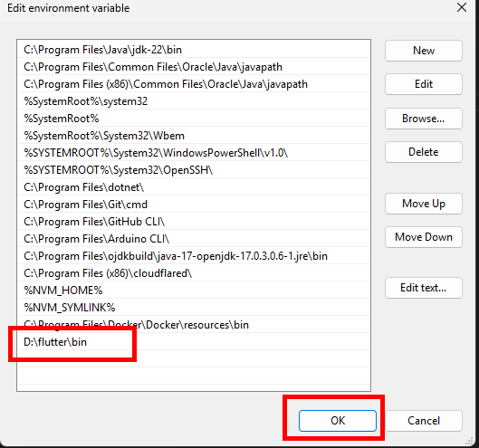
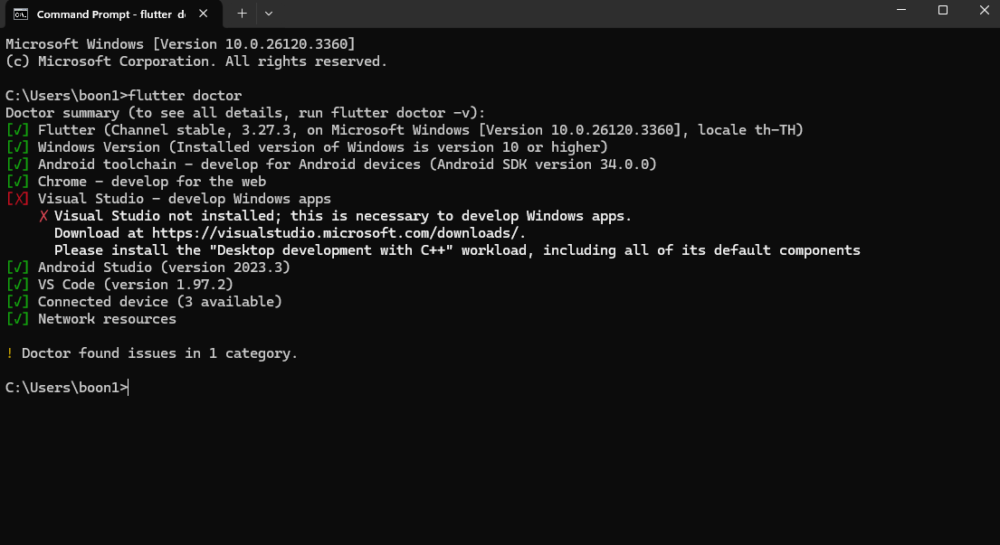

# การติดตั้งเครื่องมือสำหรับพัฒนาแอปด้วย Flutter (ฉบับเริ่มต้น)

## 1. Flutter คืออะไร?

Flutter เป็นเฟรมเวิร์กจาก Google ที่ช่วยให้เราสามารถพัฒนาแอปพลิเคชันที่รองรับทั้ง Android และ iOS ด้วยโค้ดชุดเดียว มันถูกออกแบบให้มีประสิทธิภาพสูง ใช้ภาษา Dart และมี Widget ที่สามารถปรับแต่งได้อย่างยืดหยุ่น

---

## 2. การติดตั้ง Flutter

### **Windows**

#### 2.1 ดาวน์โหลด Flutter SDK

- ไปที่: [Flutter Install](https://flutter.dev/docs/get-started/install)
  
- เลือกระบบปฏิบัติการ Windows
  
- เลือกเป็น Android
  
- เลื่อนหาแล้วกดตามรูป กด `Download and install` แล้วก็กด `flutter_windows_3.29.0-stable.zip` เพื่อทำการดาวน์โหลด
- แตกไฟล์ลงใน Drive D

#### 2.2 ตั้งค่า Path (Windows 10 และ 11)

1. **เปิดหน้าต่าง Environment Variables**

   - **Windows 10**: คลิกปุ่ม **Start** แล้วพิมพ์ `Environment Variables` → คลิก **Edit the system environment variables**
   - **Windows 11**: คลิกปุ่ม **Start** แล้วพิมพ์ `Environment Variables` → คลิก **Edit environment variables**

2. **แก้ไขตัวแปร Path**
   - ในหน้าต่าง **System Properties** ให้ไปที่แท็บ **Advanced**
   - คลิกปุ่ม **Environment Variables...**
   - 
   - ในส่วน **System Variables** ให้ค้นหาตัวแปร **Path** แล้วกด **Edit...**
   - 
3. **เพิ่มเส้นทางของ Flutter**

   - กด **New** แล้วเพิ่ม `D:\flutter\bin`
   - กด **OK** ทุกหน้าต่างเพื่อบันทึกการเปลี่ยนแปลง
   - 

4. **ตรวจสอบว่าตั้งค่าเสร็จแล้ว**
   - เปิด **Command Prompt (cmd)** แล้วพิมพ์:
     ```sh
     echo %PATH%
     ```
   - ตรวจสอบว่ามี `D:\flutter\bin` อยู่ในรายการหรือไม่

#### 2.3 ตรวจสอบการติดตั้ง

- เปิด **Command Prompt** แล้วพิมพ์:
  ```sh
  flutter doctor
  ```
- ถ้ามีการแจ้งเตือนเกี่ยวกับ Android SDK หรือ IDE ให้ทำตามคำแนะนำ


---

### **macOS/Linux**

#### 2.1 ติดตั้งผ่าน Homebrew (เฉพาะ macOS)

```sh
brew install flutter
```

#### 2.2 ตั้งค่า Path

1. แก้ไขไฟล์ `~/.zshrc` หรือ `~/.bashrc`
2. เพิ่มบรรทัดนี้เข้าไป:
   ```sh
   export PATH="$PATH:$HOME/development/flutter/bin"
   ```
3. รีโหลด shell:
   ```sh
   source ~/.zshrc  # หรือ source ~/.bashrc
   ```

#### 2.3 ตรวจสอบการติดตั้ง

```sh
flutter doctor
```

---

## 3. การติดตั้งเครื่องมือพัฒนา (IDE)

### ตัวเลือก IDE

✅ **VS Code** (เหมาะสำหรับผู้เริ่มต้น)  
✅ **Android Studio** (สำหรับการพัฒนาเต็มรูปแบบ)

### **ติดตั้ง VS Code และ Flutter Extension**

1. ดาวน์โหลด: [VS Code](https://code.visualstudio.com/)
2. เปิด VS Code → Extensions (Ctrl+Shift+X)
3. ค้นหาและติดตั้ง:
   - `Flutter`
   - `Dart`

### **ติดตั้ง Android Studio**

1. ดาวน์โหลด: [Android Studio](https://developer.android.com/studio)
2. ติดตั้งและเปิดใช้งาน
3. ไปที่ **SDK Manager** → ติดตั้ง `Android SDK`, `Android SDK Command-line Tools`
4. ไปที่ **AVD Manager** → สร้าง Emulator

---

## 4. ติดตั้ง Android Emulator หรือ iOS Simulator

### **Android Emulator** (Windows/macOS/Linux)

1. เปิด **Android Studio** → ไปที่ `AVD Manager`
2. คลิก `Create Virtual Device`
3. เลือกอุปกรณ์ เช่น `Pixel 4`
4. เลือก Android API เวอร์ชันล่าสุด → ดาวน์โหลดและติดตั้ง
5. กด `Finish` และ `Run` เพื่อเปิด Emulator

### **iOS Simulator** (เฉพาะ macOS)

1. ติดตั้ง Xcode: [Mac App Store](https://apps.apple.com/us/app/xcode/id497799835)
2. เปิด Xcode → Preferences → Components → ดาวน์โหลด Simulator ที่ต้องการ
3. เปิด Terminal และรัน:
   ```sh
   open -a Simulator
   ```